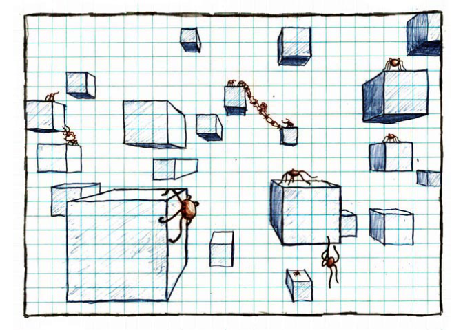

<!-- README.md is generated from README.Rmd. Please edit that file -->

# xkcd

<!-- badges: start -->

[](https://github.com/RISAW1130/xkcd/actions/workflows/R-CMD-check.yaml)
[](https://app.codecov.io/gh/RISAW1130/xkcd)
<!-- badges: end -->

The `xkcd` package provides an R interface to retrieve data about [xkcd
comics](https://xkcd.com) using the xkcd [JSON
API](https://xkcd.com/json.html). Most importantly, you can display
these comics in the RStudio plot window.

## Installation

You can install the development version of xkcd from
[GitHub](https://github.com/) with:

``` r
# install.packages("pak")
pak::pak("RISAW1130/xkcd")
```

## Example

Given an xkcd comic number, the `xkcd()` function returns a list object
with metadata about the comic.

``` r
library(xkcd)

first_comic <- xkcd(8)
print(first_comic)
#> $month
#> [1] "1"
#> 
#> $num
#> [1] 8
#> 
#> $link
#> [1] ""
#> 
#> $year
#> [1] "2006"
#> 
#> $news
#> [1] ""
#> 
#> $safe_title
#> [1] "Red spiders"
#> 
#> $transcript
#> [1] "[[Many red spiders standing on and hanging from cuboids. The cuboids hang in the air with no visible means of support.]]\n{{They are six-legged spiders}}"
#> 
#> $alt
#> [1] "They are six-legged spiders"
#> 
#> $img
#> [1] "https://imgs.xkcd.com/comics/red_spiders_small.jpg"
#> 
#> $title
#> [1] "Red spiders"
#> 
#> $day
#> [1] "1"
```

The `draw_comic()` function takes in this list of metadata, and displays
the actual comic strip image in the plot window:

``` r
draw_comic(first_comic)
```


